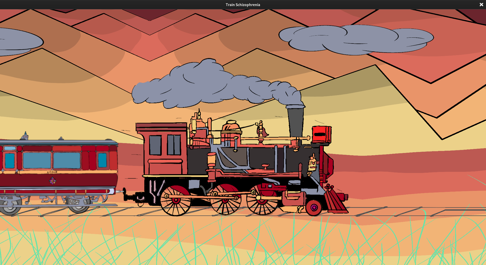

<br/>
<div align="center">
    
    <h1>Train Mystery</h1>
    <p align="center">
    A small game about solving a mystery aboard a train... if there even is one.
    <br/>
    🎉 Jeu d'enquête gagnant du <a href="https://istic.univ-rennes.fr/actualites/participez-au-palmhackathon-commit-limit-des-etudiants-de-listic"><strong>Palm'Hackaton 2023</strong></a>. 🎉
  </p>
</div>
<br/>

## A propos

### Principe
Un personnage, apparement amnésique se retrouve dans ce train et va essayer de déduire ce qu'il s'y passe. Il va alors devoir chercher des informations sur les autres passagers mais aussi sur lui-même.

### Palm'Hackaton
Le Palm'Hackaton est un marathon de programmation de 23h, organisé par [LaPalme](https://linktr.ee/lapalme),  dans lequel des équipes développent un projet de nature libre autour d'un thème fixé. Le thème du Palm'Hackaton 2023 était **Énigme et Enquête**.

## Jouer

<div align="center">
    
</div>

### Installation
1. Télécharger le répertoire
    ```sh
        git clone https://github.com/AloisRautureau/train_mystery.git
    ```
2. Compiler le projet
    ```sh
        cargo run
    ```
### Commandes

* `Backtrack` pour quitter le wagon
* `Space` pour entrer dans un wagon ou lancer une discussion
* `Leftarrow`, `Rightarrow` pour se déplacer dans le train